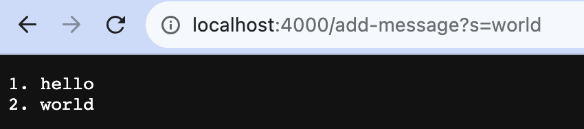

# CSE 15L Lab Report2

## Part 1  
The code of StringServer is as follows:  
  

***  

  
1. When we start our server, a `Handler` object is created and `list` is initialized, which is a ArrayList to storage string.  
2. When we do a request `http://localhost:4000/add-message?s=hello`, the `handleRequest(URI url)` is called by the whole url as an argument. the value of `url.getPath()` equals to `/add-message?s=hello`, so `url.getPath().contains("/add-message")` is true.
3. The value of `url.getQuery()` is equal to `"s=hello"`. `split("=")` will splits the String into multiple Strings by separator `"="` and return an array `["s", "hello"]` to `parameters`.
4. Since `parameters[0].equals["s"]` is true, `list.add()` is called.
5. `list.add(Integer.toString(list.size() + 1) + ". " + parameters[1]);`
   - `(Integer.toString(list.size() + 1) + ". " + parameters[1])` Every time we get the size of the list plus 1 and convert it to String from Integet. Add `. ` and `parameters[1]` after that. The result of the value equals to `"1. hello"`.
   - `list.add("1. hello)` means add the String `"1. hello"` to list and `list.size()` equals to 1 now.  
6. `return String.join("\n", list)`
   - `join("\n", list)` method concatenates the given `list` with `\n` and returns the concatenated string.
   - Since there is only one String in `list`, it returns `"1. hello"`.

  
1. When we do a request `http://localhost:4000/add-message?s=world`, because it has the same path with last request, it is the same as the preceding runing steps up until the 5 step.
2. `list.add(Integer.toString(list.size() + 1) + ". " + parameters[1]);`
   - Since `list` already have one String and the size is 1, `list.size() + 1` equals to 2 and `paramters[1]` equals to `"world"`.
   - `"2. world"` is added to the `list` and `list.size()` equals to 2 now.
3. `return String.join("\n", list)`
   - `list` contains `("1. hello", "2. world")` and we concatenates them with `\n`, so we return the String `"1. hello\n2.world"`.

***

## Part 2
1. The path to the private key for my SSH key on my computer. id_rsa is my private SSH key and id_rsa.pub is my public SSH key.

1. The path to the public key for my SSH key on ieng6. Since I copy the public SSH key to ieng6 server, the file called authorized_keys is the public SSH key.

1. log into ieng6 without being asked for a password.

***  

## Part 3
1. Understand how to connect the remote server with ssh, and log in without password through SSH key.
2. learn how to use VS Code and using Bash on Windows in VS code.
3. learn related methods of processing URL in Java.

